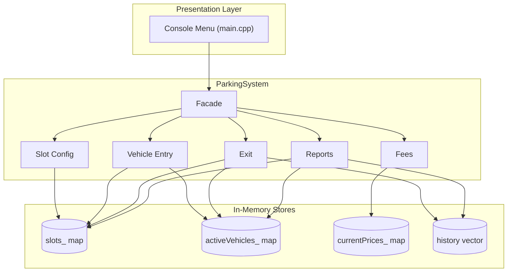
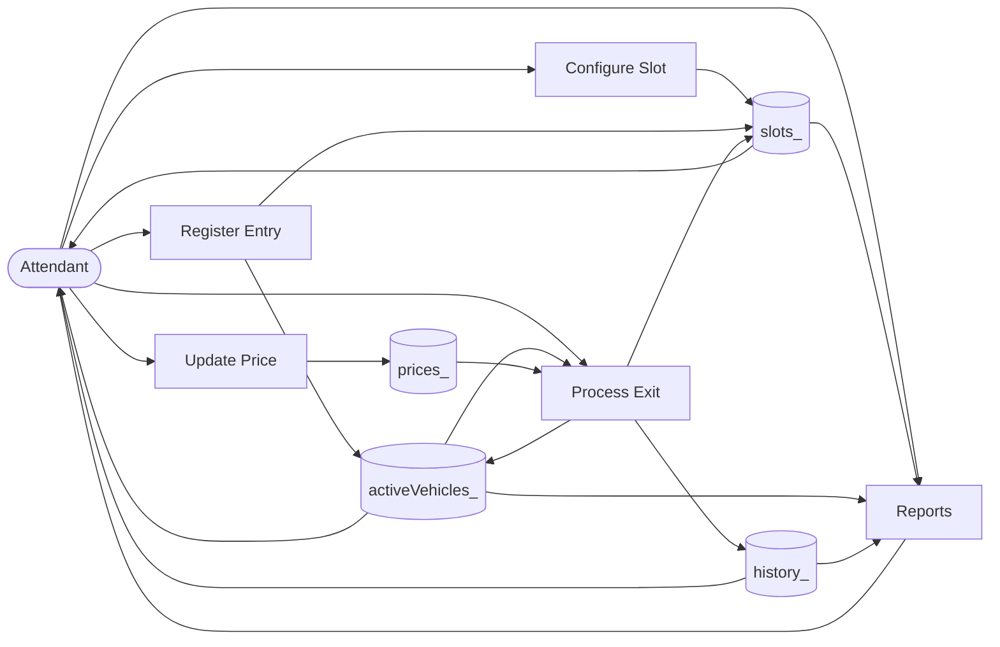
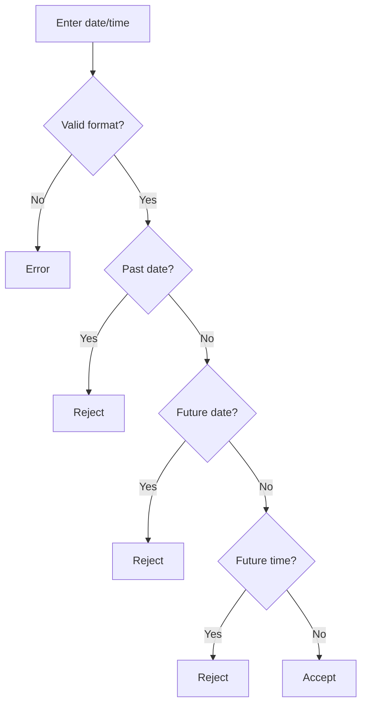

# Kigali Smart Parking Management System

A console-based **Smart Parking Management System** for Kigali City, built in **C++** with **in-memory data structures only** (no database). Uses `using namespace std;` for clean console I/O (`cout`, `cin`).

---

## Table of Contents

1. [Overview](#overview)
2. [Features](#features)
3. [Default Tariffs](#default-parking-tariffs)
4. [Data Structures](#data-structures-used)
5. [OOP Design](#oop-design)
6. [Compile & Run](#how-to-compile-and-run)
7. [Menu Options](#menu-options)
8. [Validation Rules](#input-formats-and-validation)
9. [Architecture Diagrams](#system-architecture--data-flow-diagrams)
10. [Testing Guide](#quick-test-walkthrough)
11. [Project Files](#project-structure)

---

## Overview

The system helps parking attendants:

- Configure and track parking slots by vehicle type and zone
- **Automatically allocate** a free matching slot on vehicle entry
- Calculate parking fees at exit using ceiling-hour billing
- Store transaction history and generate revenue reports

---

## Features

| Task | Description |
|------|-------------|
| **Task 1** | Configure parking slots (unique ID, type, zone, status) |
| **Task 2** | Register entry; system auto-assigns slot |
| **Task 3** | Ceiling-hour fees; live price updates |
| **Task 4** | Exit, release slot, receipt, save transaction |
| **Task 5** | Reports: slots, parked vehicles, history, revenue |

**Billing:** Fees at exit only. Partial hours round up (15 min → 1 hr). Price updates do not change history.

---

## Default Parking Tariffs

| Vehicle | Rate (RWF/hr) |
|---------|---------------|
| Motorcycle | 500 |
| Car | 1,000 |
| Truck | 2,000 |

Trucks use truck-only slots (demo: `T-C1`). Same billing rules as other types.

---

## Data Structures Used

| Structure | Linear / Non-linear | Purpose |
|-----------|---------------------|---------|
| `unordered_map<string, ParkingSlot>` | **Non-linear** | Slots by ID — O(1) lookup |
| `unordered_map<string, VehicleEntry>` | **Non-linear** | Active vehicles by plate |
| `unordered_map<VehicleType, int>` | **Non-linear** | Current hourly tariffs |
| `vector<ParkingTransaction>` | **Linear** | Completed session history |

See **`expl.txt`** for simple explanations, OOP details, and O(1) vs O(n).

---

## OOP Design

| Principle | Where used |
|-----------|------------|
| **Encapsulation** | `ParkingSystem` hides maps/vector; public methods only |
| **Abstraction** | Menu calls simple options; complex logic inside `ParkingSystem` |
| **Inheritance** | `MotorcycleTariff`, `CarTariff`, `TruckTariff` extend `TariffPolicy` |
| **Polymorphism** | `tariffPolicies_` loop calls `getDefaultRate()` on each child type |

---

## How to Compile and Run

### Dev C++

1. Open Dev C++ → **Console Application (C++)**
2. Use `main.cpp` as source
3. Press **F11**

### Command line

```bash
g++ -std=c++11 -o parking.exe main.cpp
parking.exe
```

---

## Menu Options

| # | Action |
|---|--------|
| 1 | Add parking slot |
| 2 | View all slots |
| 3 | View available slots |
| 4 | Register vehicle entry (auto slot) |
| 5 | Process vehicle exit |
| 6 | View parked vehicles |
| 7 | Update parking price |
| 8 | View tariffs |
| 9 | Vehicle history (by plate) |
| 10 | All transaction history |
| 11 | Daily revenue |
| 0 | Exit |

> Only **`0`** exits. `09`, `08`, letters → error, program continues.

---

## Input Formats and Validation

### Plate number

- **6–8 characters**, no spaces, no hyphens
- Rwanda or foreign plates (e.g. `RAB123A`, `UG1234AB`)

### Date and time (entry & exit)

Format: **`DD-MM-YYYY HH:MM`** (24-hour)

| Rule | Allowed? |
|------|----------|
| **Today's date only** | Yes |
| **Past dates** (yesterday, etc.) | No |
| **Future dates** (tomorrow, etc.) | No |
| **Past time today** (e.g. 08:00 when now is 14:00) | Yes |
| **Future time today** (e.g. 16:00 when now is 14:00) | No |
| Exit before entry | No |

The program shows today's date when prompting for entry/exit time.

### Slot ID

- 2–15 chars, starts with letter, alphanumeric + hyphens (`C-A1`)

### Zone

- Letters, spaces, hyphens only (`Downtown`)

---

## System Architecture & Data Flow Diagrams

Open **`diagrams/all-diagrams.html`** in a browser, or copy Mermaid from **`diagrams/DIAGRAMS.md`**.

### System Architecture (Mermaid)



### Data Flow Diagram (Mermaid)



### Date/Time Validation Flow



---

## Quick Test Walkthrough

Use **today's date** and times **not in the future**.

| Step | Action | Expected |
|------|--------|----------|
| 1 | Add slots manually (option 1) or use existing configured slots | Slots listed |
| 2 | **4** → `RAB123A`, type `2`, entry `TODAY 08:00` | Slot auto-assigned |
| 3 | **6** | Vehicle in parked list |
| 4 | **5** → `RAB123A`, exit `TODAY 09:20` | 2 hrs × 1000 = 2000 RWF |
| 5 | **9** → `09` at menu | Error; program continues |
| 6 | Entry `YESTERDAY` | Rejected: past date |
| 7 | Exit `TODAY` future time | Rejected: future time |
| 8 | **0** | Exit program |

---

## Project Structure

```
dsa/
├── main.cpp                 # Full application
├── expl.txt                 # Data structures + OOP + billing explained simply
├── README.md                # This file
├── .gitignore
└── diagrams/
    ├── all-diagrams.html    # Visual diagrams in browser
    ├── DIAGRAMS.md          # Mermaid source codes
    ├── SYSTEM ARCHITECTURE DIAGRAM.png
    └── DATA FLOW DIAGRAM.png
```

---

## Design Notes

- Slots are **automatically assigned** — attendant does not pick slot ID
- Invalid input never crashes the program
- `try-catch` protects menu handlers and main loop
- Completed transactions store `ratePerHour` so price changes do not alter history

---

Academic project — Data Structures & Algorithms (DSA).
